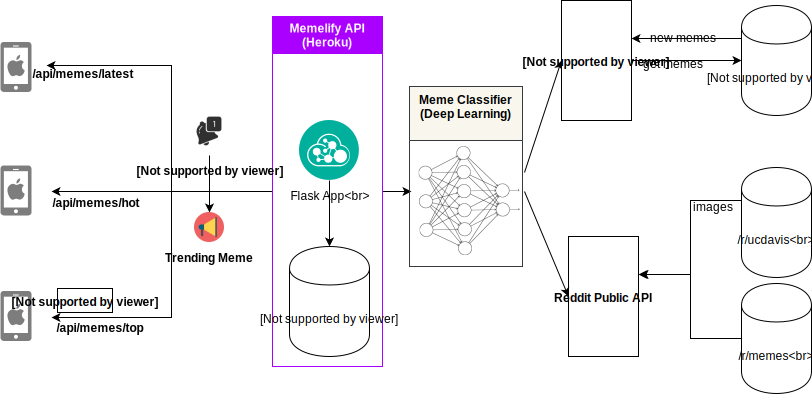

# Memelify Backend Service

For learning purposes, we built our backend (mostly) from scratch with [Flask](http://flask.pocoo.org/). Our backend crawls from multiple sources (subreddits, Facebook Graph API) and applied Machine Learning to "extract" memes only.



Endpoint : `https://memelify.herokuapp.com/api/memes/latest`


##  Usage

| API               |  Return                            |
|:------------------|:-----------------------------------|
|`/api/meme/latest` | list of latest memes (default=10)  |
|`/api/meme/hot`    | list of trending memes (default=10)|
|`/api/meme/top`    | display "Meme of the Day"          |

* Extra parameters (for pagination)

| Parameter  |  Detail                                 |
|:-----------|:----------------------------------------|
|`offset`    |  Integer - offset index starting from 0 |
| `limit`    |  Integer - number of items to return    |


For example, I would like to make an API call to returns a list of 2 latest memes starting from index 3.
```
http://host.domain/api/memes/latest?offset=3&limit=5
```
The response is a json object.

```javascript
{
    memes: [
        {
            created: "2018-11-20 09:46:06",
            id: "9yqr2o",
            likes: 188,
            title: "The L is upon me",
            url: "https://i.redd.it/op70k6pvigz11.png"
        },
        {
            created: "2018-11-19 22:56:02",
            id: "9ylzlk",
            likes: 147,
            title: "I see your Gucci n95 and I raise you my own fancy mask.",
            url: "https://i.redd.it/lca2e9jyadz11.jpg"
        }],
}
```

## How did we apply Machine Learning?


## Reference:

[1] How Instagram Feed works [Article](https://blogs.vmware.com/vfabric/2013/04/how-instagram-feeds-work-celery-and-rabbitmq.html)
